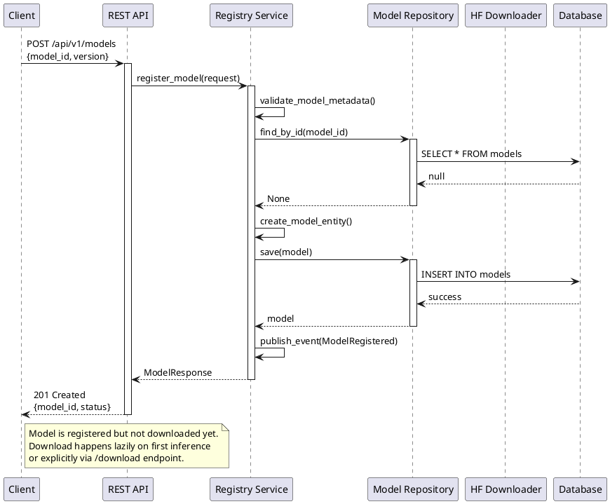
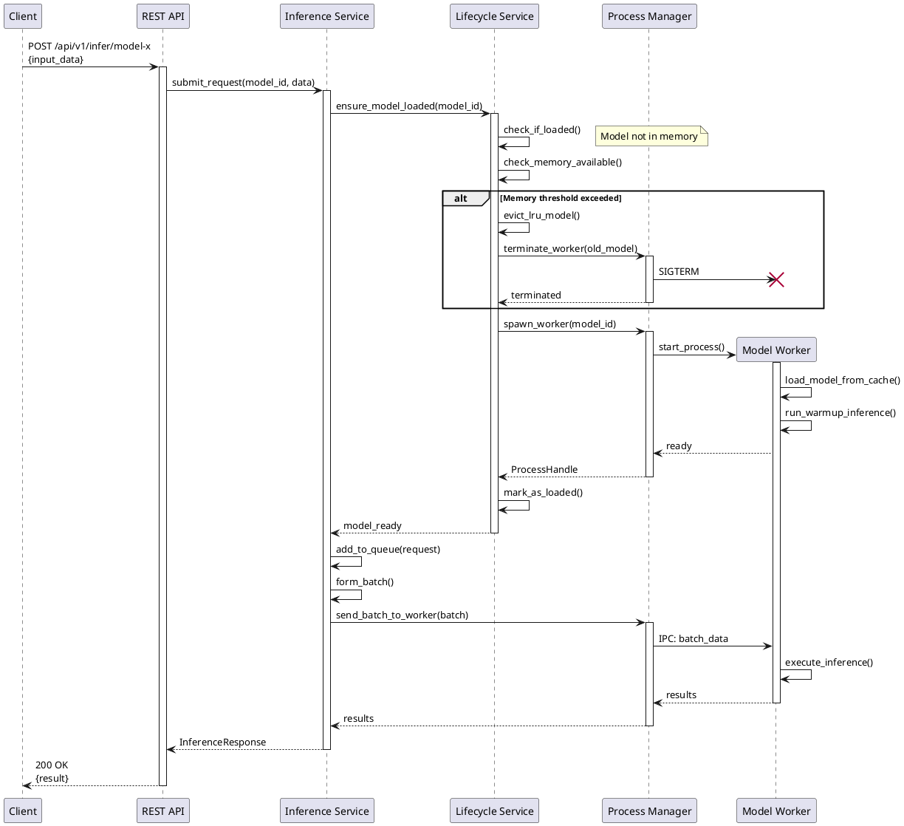
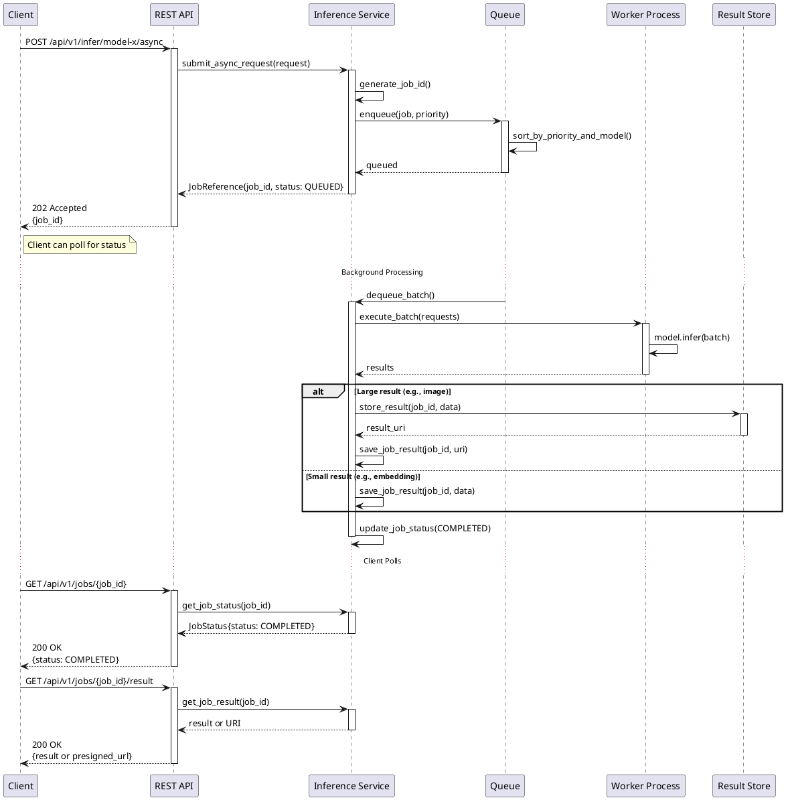
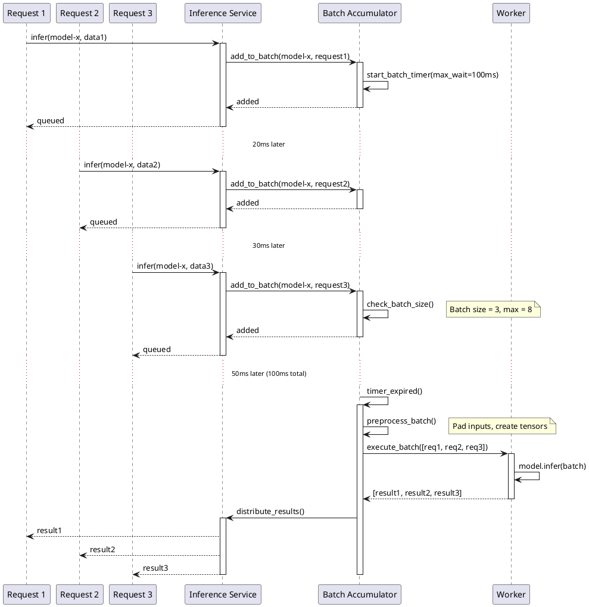
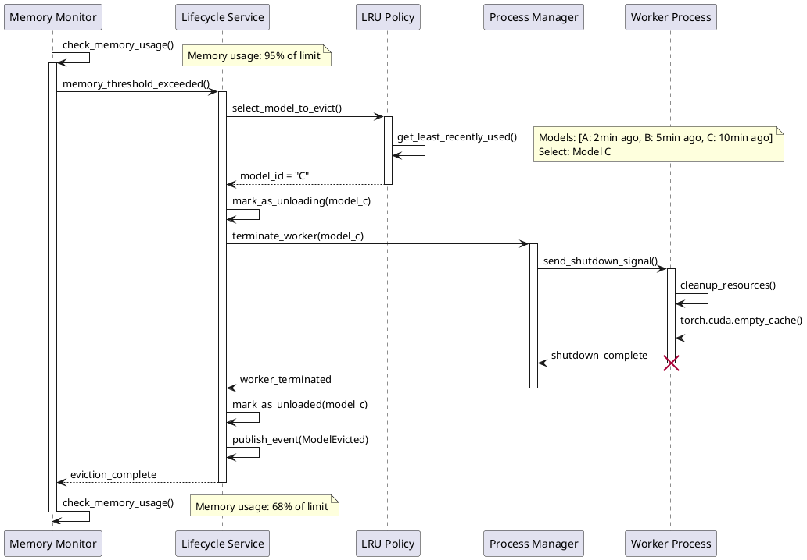
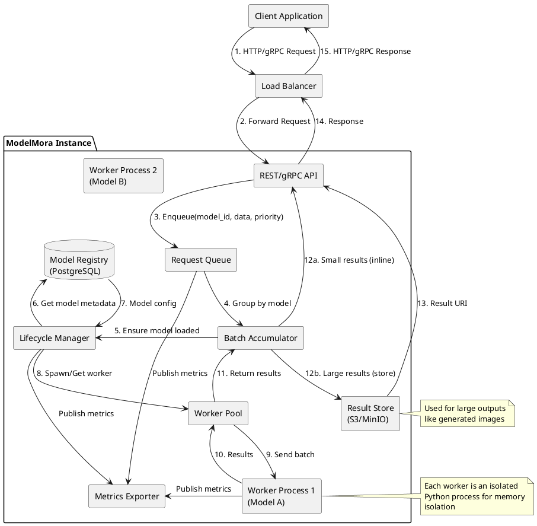
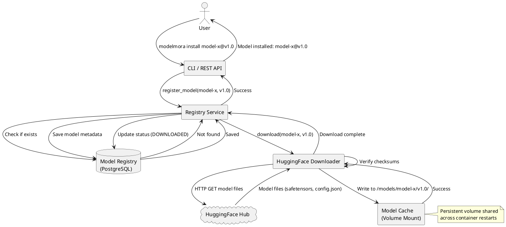
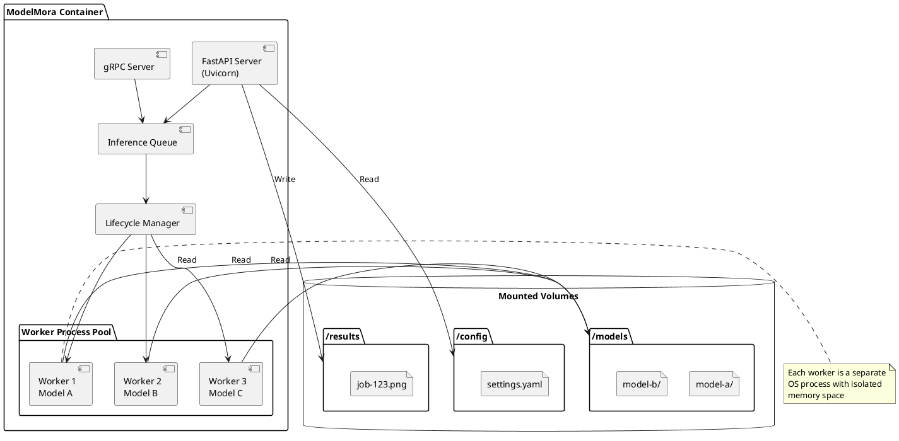
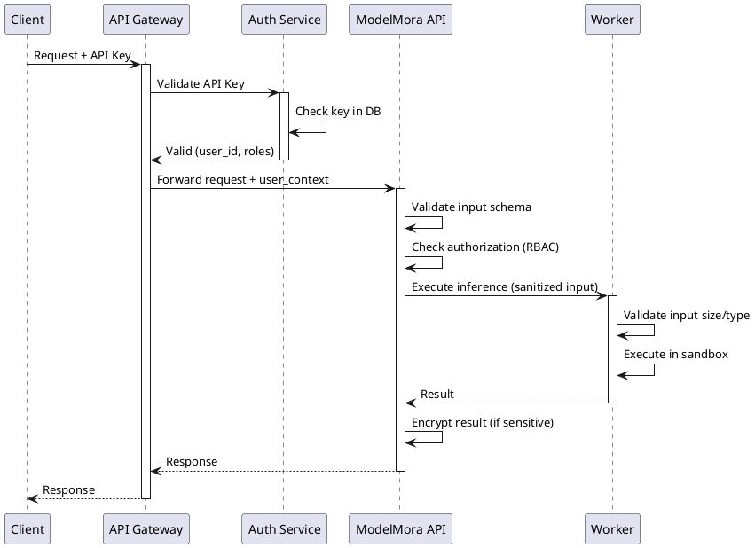

# ModelMora - System Architecture Document

**Version:** 1.0.0
**Date:** 2025-12-04
**Status:** Draft

---

## 1. Introduction

### 1.1 Purpose

This document describes the system architecture for ModelMora, a lightweight model serving framework. It defines the bounded contexts, architectural patterns, component interactions, and deployment strategy.

### 1.2 Architectural Principles

ModelMora follows these core principles:

- **Domain-Driven Design (DDD)**: Clear bounded contexts with ubiquitous language
- **Hexagonal Architecture (Ports & Adapters)**: Separation of business logic from infrastructure
- **Test-Driven Development (TDD)**: Test-first approach with high coverage
- **Single Responsibility**: Each component has one clear purpose
- **Dependency Inversion**: High-level modules don't depend on low-level modules
- **SOLID Principles**: Maintainable, extensible codebase

### 1.3 Architecture Overview

ModelMora uses a **layered hexagonal architecture** with the following characteristics:

- **Domain Layer**: Pure business logic, no external dependencies
- **Application Layer**: Command handlers and orchestration
- **Infrastructure Layer**: External integrations (database, filesystem, HTTP)
- **Presentation Layer**: API interfaces (REST, gRPC, CLI)

### 1.4 POC-Validated Architecture Decisions

The following critical architecture decisions were validated through production-level POCs (Phase 0.3):

**1. Multi-Process Worker Architecture** ✅ **(POC 1: Memory Isolation)**

- **Decision**: One model per subprocess, terminate process to unload
- **Validation**: Subprocess achieves **5000x better memory reclamation** (0.1MB leak vs 516MB with GC)
- **Impact**: Ensures reliable memory cleanup, prevents gradual memory exhaustion
- **Implementation**: `multiprocessing.Process` per model, IPC via queues/pipes

**2. Lazy Loading Strategy** ✅ **(POC 3: Model Lifecycle)**

- **Decision**: Load models on first request, not at startup
- **Validation**: Load time **2s** for small-medium models (acceptable latency)
- **Impact**: Reduces startup time, optimizes memory usage
- **Fallback**: Warmup endpoint for pre-loading critical models

**3. asyncio.PriorityQueue for Request Scheduling** ✅ **(POC 4: Priority Queue)**

- **Decision**: Use `asyncio.PriorityQueue` with 4 priority levels
- **Validation**: **730,108 ops/sec** throughput, **0.7μs** latency, **100%** priority correctness
- **Impact**: 730x headroom above target (1,000 req/sec), negligible overhead
- **Priority Levels**: CRITICAL(1), HIGH(2), NORMAL(3), LOW(4)

**4. gRPC for Streaming Large Payloads** ✅ **(POC 2: gRPC Streaming)**

- **Decision**: gRPC for image generation, REST for simple queries
- **Validation**: **31.92 MB/s** single client, **33.31 MB/s** concurrent, **23.53ms** latency
- **Impact**: Efficient streaming, acceptable performance for large payloads
- **Protocol**: Protocol Buffers with server-side streaming

**Performance Benchmarks:**

- Model load time: 2s (cached)
- Queue latency: <1μs (0.0002% of total request time)
- Memory per model: 90-500MB (plan for 1.5x = 135-750MB per worker)
- Memory leak: 0.1MB/unload (subprocess) vs 516MB/unload (GC) → **subprocess mandatory**

---

## 2. Bounded Contexts

Following DDD principles, ModelMora is organized into four bounded contexts:

### 2.1 Registry Context

**Responsibility**: Model catalog management, versioning, and metadata storage.

**Core Entities**:

- `Model`: Represents a machine learning model with metadata
- `ModelVersion`: Specific version of a model
- `ModelLock`: Lock file entry for reproducible deployments
- `ModelConfig`: Curated configuration for model capabilities

**Value Objects**:

- `ModelId`: HuggingFace identifier
- `TaskType`: Enumeration of supported tasks
- `ResourceRequirements`: Memory and compute specifications
- `Checksum`: SHA256 hash for integrity

**Aggregates**:

- `ModelCatalog`: Root aggregate managing model collection

**Domain Events**:

- `ModelRegistered`
- `ModelVersionChanged`
- `ModelDeleted`
- `ModelDownloadRequested`

**Repositories**:

- `IModelRepository`: Interface for model persistence
- `ILockFileRepository`: Interface for lock file operations

**Handlers**:

- `RegisterModelHandler`: Handles model registration
- `ListModelsHandler`: Handles model listing with filters
- `GetModelHandler`: Handles retrieving model details
- `UpdateModelHandler`: Handles model configuration updates
- `DeleteModelHandler`: Handles model deletion
- `GenerateLockHandler`: Handles lock file generation
- `DownloadModelHandler`: Handles model downloading

---

### 2.2 Lifecycle Context

**Responsibility**: Model loading, unloading, memory management, and health monitoring.

**Core Entities**:

- `LoadedModel`: A model instance in memory
- `ModelProcess`: Worker process managing model execution
- `MemoryMonitor`: Tracks memory usage

**Value Objects**:

- `ModelState`: Enumeration (UNLOADED, LOADING, LOADED, UNHEALTHY)
- `MemoryUsage`: Current memory metrics
- `HealthStatus`: Health check results

**Aggregates**:

- `ModelLifecycleManager`: Root aggregate coordinating model lifecycle

**Domain Events**:

- `ModelLoadRequested`
- `ModelLoaded`
- `ModelLoadFailed`
- `ModelUnloaded`
- `ModelEvicted`
- `MemoryThresholdExceeded`

**Policies**:

- `LRUEvictionPolicy`: Determines which model to unload
- `WarmupPolicy`: Pre-loading strategy

**Services**:

- `ModelLoader`: Loads models into memory (validated: 2s load time for small-medium models)
- `ProcessManager`: Manages worker processes (POC-validated: subprocess isolation required)
- `HealthChecker`: Verifies model integrity

**Handlers**:

- `LoadModelHandler`: Handles model loading into memory
- `UnloadModelHandler`: Handles model unloading from memory (POC-validated: must terminate subprocess, not GC)
- `WarmupModelHandler`: Handles model warmup/preloading
- `CheckHealthHandler`: Handles model health verification
- `EvictModelHandler`: Handles LRU-based model eviction

**POC-Validated Memory Management Strategy:**

1. **Process Isolation**: Each model runs in dedicated subprocess
   - Memory reclamation: 0.1MB leak (subprocess) vs 516MB leak (GC)
   - GPU cleanup: Subprocess termination ensures complete VRAM release

2. **LRU Eviction**: When memory threshold exceeded:
   - Identify least recently used model
   - Terminate subprocess (kills process, releases all memory)
   - Remove from loaded model registry

3. **Memory Budgeting**: Reserve 1.5x model footprint per worker
   - Small model (90MB): Reserve 135MB
   - Medium model (420MB): Reserve 630MB
   - 10 concurrent models: ~5GB RAM minimum

---

### 2.3 Inference Context

**Responsibility**: Request handling, batching, execution, and result management.

**Core Entities**:

- `InferenceRequest`: A request for model inference
- `InferenceJob`: Async job tracking
- `Batch`: Collection of requests for same model
- `InferenceResult`: Output from model execution

**Value Objects**:

- `JobId`: Unique identifier for async requests
- `JobStatus`: Enumeration (QUEUED, PROCESSING, COMPLETED, FAILED)
- `Priority`: Request priority level
- `InputData`: Task-specific input payload
- `OutputData`: Task-specific output payload

**Aggregates**:

- `InferenceQueue`: Root aggregate managing request queue

**Domain Events**:

- `InferenceRequested`
- `RequestQueued`
- `BatchFormed`
- `InferenceStarted`
- `InferenceCompleted`
- `InferenceFailed`

**Services**:

- `BatchAccumulator`: Groups requests into batches
- `InferenceExecutor`: Executes model inference
- `ResultStore`: Stores large results (images)

**Policies**:

- `PriorityPolicy`: Determines request ordering (POC-validated: 100% correctness, 4 priority levels)
- `BatchingPolicy`: Configures batch parameters
- `TimeoutPolicy`: Handles request timeouts

**Handlers**:

- `SubmitRequestHandler`: Handles inference request submission (POC-validated: 0.7μs queue latency)
- `ExecuteBatchHandler`: Handles batch inference execution
- `GetJobStatusHandler`: Handles job status retrieval
- `GetJobResultHandler`: Handles job result retrieval
- `CancelRequestHandler`: Handles request cancellation

**POC-Validated Queue Performance:**

- **Implementation**: `asyncio.PriorityQueue` (async-native, stdlib)
- **Throughput**: 730,108 ops/sec (730x above 1,000 req/sec target)
- **Latency**: 0.7μs enqueue, 1.7μs dequeue (negligible)
- **Priority Ordering**: 100% correct under concurrent load
- **Capacity**: Massive headroom, queue will never be bottleneck

**Priority Levels (Validated):**

1. **CRITICAL (1)**: SLA-bound, real-time inference
2. **HIGH (2)**: User-facing, interactive requests
3. **NORMAL (3)**: Batch processing, standard workload
4. **LOW (4)**: Background tasks, analytics

FIFO within same priority (timestamp-based ordering).

---

### 2.4 Observability Context

**Responsibility**: Metrics collection, logging, tracing, and health reporting.

**Core Entities**:

- `Metric`: Time-series data point
- `LogEntry`: Structured log message
- `Trace`: Distributed tracing span

**Value Objects**:

- `MetricType`: Enumeration (COUNTER, GAUGE, HISTOGRAM)
- `LogLevel`: Severity level
- `TraceId`: Correlation identifier

**Services**:

- `MetricsCollector`: Gathers performance metrics
- `Logger`: Structured logging
- `Tracer`: Distributed tracing

**Handlers**:

- `RecordMetricHandler`: Handles metric recording
- `LogEventHandler`: Handles event logging
- `CreateTraceHandler`: Handles distributed trace creation
- `ExportMetricsHandler`: Handles Prometheus metrics export
- `HealthCheckHandler`: Handles health check requests

---

## 3. Hexagonal Architecture

### 3.1 Ports (Interfaces)

#### Primary Ports (Driving)

Application exposes these interfaces to the outside world:

```python
# REST API Port
class IModelAPI(Protocol):
    def register_model(request: RegisterModelRequest) -> ModelResponse
    def list_models(filters: ModelFilters) -> List[ModelResponse]
    def infer(model_id: str, request: InferenceRequest) -> InferenceResponse

# gRPC Port
class IInferenceService(Protocol):
    def Infer(request: InferenceRequest) -> InferenceResponse
    def InferAsync(request: InferenceRequest) -> JobReference

# CLI Port
class IModelMoraCLI(Protocol):
    def install(model_id: str, version: Optional[str]) -> None
    def list_models(task_type: Optional[str]) -> None
```

#### Secondary Ports (Driven)

Application depends on these interfaces (implemented by adapters):

```python
# Repository Ports
class IModelRepository(Protocol):
    def save(model: Model) -> None
    def find_by_id(model_id: ModelId) -> Optional[Model]
    def find_all(filters: dict) -> List[Model]
    def delete(model_id: ModelId) -> None

# External Service Ports
class IModelDownloader(Protocol):
    def download(model_id: str, version: str) -> Path
    def validate_checksum(path: Path, expected: str) -> bool

class IObjectStorage(Protocol):
    def store(data: bytes, key: str) -> str
    def get_presigned_url(key: str, expiration: int) -> str

# Infrastructure Ports
class IProcessManager(Protocol):
    def spawn_worker(model_id: str) -> ProcessHandle
    def send_request(handle: ProcessHandle, data: dict) -> dict
    def terminate(handle: ProcessHandle) -> None

class IMetricsExporter(Protocol):
    def record_counter(name: str, value: float, labels: dict) -> None
    def record_histogram(name: str, value: float, labels: dict) -> None
```

### 3.2 Adapters

#### Primary Adapters (Input)

- `FastAPIAdapter`: REST API implementation
- `GRPCAdapter`: gRPC service implementation
- `CLIAdapter`: Click-based command-line interface

#### Secondary Adapters (Output)

- `PostgreSQLModelRepository`: SQL database for model metadata
- `HuggingFaceDownloader`: Downloads from HF Hub
- `S3ObjectStorage`: AWS S3/MinIO for result storage
- `MultiprocessingManager`: Python multiprocessing for workers
- `PrometheusExporter`: Metrics export for Prometheus

---

## 4. Component Architecture

### 4.1 High-Level Component Diagram

```plantuml
@startuml
!include https://raw.githubusercontent.com/plantuml-stdlib/C4-PlantUML/master/C4_Component.puml

Container_Boundary(api, "API Layer") {
    Component(rest_api, "REST API", "FastAPI", "HTTP endpoints for model management and inference")
    Component(grpc_api, "gRPC API", "grpcio", "High-performance inference service")
    Component(cli, "CLI", "Click", "Command-line interface")
}

Container_Boundary(app, "Application Layer") {
    Component(registry_svc, "Registry Service", "Python", "Model catalog management")
    Component(lifecycle_svc, "Lifecycle Service", "Python", "Model loading/unloading orchestration")
    Component(inference_svc, "Inference Service", "Python", "Request queuing and execution")
    Component(observability_svc, "Observability Service", "Python", "Metrics and logging")
}

Container_Boundary(domain, "Domain Layer") {
    Component(registry_domain, "Registry Domain", "Python", "Model entities and business rules")
    Component(lifecycle_domain, "Lifecycle Domain", "Python", "Memory management policies")
    Component(inference_domain, "Inference Domain", "Python", "Batching and scheduling logic")
}

Container_Boundary(infra, "Infrastructure Layer") {
    Component(db_adapter, "Database Adapter", "SQLAlchemy", "PostgreSQL persistence")
    Component(hf_adapter, "HuggingFace Adapter", "transformers", "Model downloading")
    Component(storage_adapter, "Storage Adapter", "boto3", "S3/MinIO integration")
    Component(process_adapter, "Process Adapter", "multiprocessing", "Worker process management")
    Component(metrics_adapter, "Metrics Adapter", "prometheus_client", "Metrics export")
}

Container_Boundary(workers, "Worker Processes") {
    Component(model_worker, "Model Worker", "Python", "Isolated process per model")
}

Rel(rest_api, registry_svc, "Uses")
Rel(rest_api, inference_svc, "Uses")
Rel(grpc_api, inference_svc, "Uses")
Rel(cli, registry_svc, "Uses")

Rel(registry_svc, registry_domain, "Uses")
Rel(lifecycle_svc, lifecycle_domain, "Uses")
Rel(inference_svc, inference_domain, "Uses")

Rel(registry_svc, db_adapter, "Uses")
Rel(registry_svc, hf_adapter, "Uses")
Rel(lifecycle_svc, process_adapter, "Uses")
Rel(inference_svc, storage_adapter, "Uses")
Rel(observability_svc, metrics_adapter, "Uses")

Rel(lifecycle_svc, model_worker, "Manages")
Rel(inference_svc, model_worker, "Sends requests")

@enduml
```

### 4.2 Directory Structure

```bash
src/modelmora/
├── registry/                                   # Registry Bounded Context
│   ├── domain/                                 # Domain Layer
│   │   ├── model.py                            # Model entity
│   │   ├── model_version.py                    # ModelVersion entity
│   │   ├── model_lock.py                       # ModelLock entity
│   │   ├── model_config.py                     # ModelConfig entity
│   │   ├── model_catalog.py                    # ModelCatalog aggregate
│   │   ├── model_id.py                         # ModelId value object
│   │   ├── task_type.py                        # TaskType value object
│   │   ├── checksum.py                         # Checksum value object
│   │   ├── resource_requirements.py            # ResourceRequirements value object
│   │   ├── i_model_repository.py               # IModelRepository interface
│   │   ├── i_lock_file_repository.py           # ILockFileRepository interface
│   │   ├── events/
│   │   │   ├── model_registered.py             # ModelRegistered event
│   │   │   ├── model_version_changed.py        # ModelVersionChanged event
│   │   │   ├── model_deleted.py                # ModelDeleted event
│   │   │   └── model_download_requested.py     # ModelDownloadRequested event
│   │   └── exceptions/
│   │       ├── model_not_found_exception.py    # ModelNotFoundException
│   │       ├── model_already_exists_exception.py  # ModelAlreadyExistsException
│   │       └── invalid_model_exception.py      # InvalidModelException
│   │
│   ├── application/                            # Application Layer
│   │   ├── register_model/
│   │   │   ├── register_model_command.py       # RegisterModelCommand
│   │   │   └── register_model_handler.py       # RegisterModelHandler
│   │   ├── list_models/
│   │   │   ├── list_models_command.py          # ListModelsCommand
│   │   │   └── list_models_handler.py          # ListModelsHandler
│   │   ├── get_model/
│   │   │   ├── get_model_command.py            # GetModelCommand
│   │   │   └── get_model_handler.py            # GetModelHandler
│   │   ├── update_model/
│   │   │   ├── update_model_command.py         # UpdateModelCommand
│   │   │   └── update_model_handler.py         # UpdateModelHandler
│   │   ├── delete_model/
│   │   │   ├── delete_model_command.py         # DeleteModelCommand
│   │   │   └── delete_model_handler.py         # DeleteModelHandler
│   │   ├── download_model/
│   │   │   ├── download_model_command.py       # DownloadModelCommand
│   │   │   └── download_model_handler.py       # DownloadModelHandler
│   │   ├── generate_lock/
│   │   │   ├── generate_lock_command.py        # GenerateLockCommand
│   │   │   └── generate_lock_handler.py        # GenerateLockHandler
│   │   └── dto/
│   │       ├── model_response_dto.py           # ModelResponseDTO
│   │       ├── model_list_dto.py               # ModelListDTO
│   │       └── lock_file_dto.py                # LockFileDTO
│   │
│   └── infrastructure/                         # Infrastructure Layer
│       ├── sql/
│       │   ├── sql_model_repository.py         # PostgreSQL IModelRepository impl
│       │   ├── sql_lock_file_repository.py     # PostgreSQL ILockFileRepository impl
│       │   ├── models/
│       │   │   ├── model_orm.py                # SQLAlchemy Model ORM
│       │   │   └── model_version_orm.py        # SQLAlchemy ModelVersion ORM
│       │   └── migrations/
│       ├── downloaders/
│       │   ├── i_model_downloader.py           # IModelDownloader interface
│       │   ├── huggingface_downloader.py       # HuggingFace Hub implementation
│       │   └── local_downloader.py             # Local filesystem implementation
│       └── config/
│           ├── settings.py                     # Pydantic settings
│           └── model_configs.yaml              # Curated metadata
│
├── lifecycle/                                  # Lifecycle Bounded Context
│   ├── domain/                                 # Domain Layer
│   │   ├── loaded_model.py                     # LoadedModel entity
│   │   ├── model_process.py                    # ModelProcess entity
│   │   ├── memory_monitor.py                   # MemoryMonitor entity
│   │   ├── model_lifecycle_manager.py          # ModelLifecycleManager aggregate
│   │   ├── model_state.py                      # ModelState value object
│   │   ├── memory_usage.py                     # MemoryUsage value object
│   │   ├── health_status.py                    # HealthStatus value object
│   │   ├── model_loader.py                     # ModelLoader service
│   │   ├── health_checker.py                   # HealthChecker service
│   │   ├── i_process_manager.py                # IProcessManager interface
│   │   ├── policies/
│   │   │   ├── lru_eviction_policy.py          # LRUEvictionPolicy
│   │   │   └── warmup_policy.py                # WarmupPolicy
│   │   ├── events/
│   │   │   ├── model_load_requested.py         # ModelLoadRequested event
│   │   │   ├── model_loaded.py                 # ModelLoaded event
│   │   │   ├── model_load_failed.py            # ModelLoadFailed event
│   │   │   ├── model_unloaded.py               # ModelUnloaded event
│   │   │   ├── model_evicted.py                # ModelEvicted event
│   │   │   └── memory_threshold_exceeded.py    # MemoryThresholdExceeded event
│   │   └── exceptions/
│   │       ├── model_load_failed_exception.py  # ModelLoadFailedException
│   │       ├── insufficient_memory_exception.py  # InsufficientMemoryException
│   │       └── model_not_loaded_exception.py   # ModelNotLoadedException
│   │
│   ├── application/                            # Application Layer
│   │   ├── load_model/
│   │   │   ├── load_model_command.py           # LoadModelCommand
│   │   │   └── load_model_handler.py           # LoadModelHandler
│   │   ├── unload_model/
│   │   │   ├── unload_model_command.py         # UnloadModelCommand
│   │   │   └── unload_model_handler.py         # UnloadModelHandler
│   │   ├── warmup_model/
│   │   │   ├── warmup_model_command.py         # WarmupModelCommand
│   │   │   └── warmup_model_handler.py         # WarmupModelHandler
│   │   ├── check_health/
│   │   │   ├── check_health_command.py         # CheckHealthCommand
│   │   │   └── check_health_handler.py         # CheckHealthHandler
│   │   ├── evict_model/
│   │   │   ├── evict_model_command.py          # EvictModelCommand
│   │   │   └── evict_model_handler.py          # EvictModelHandler
│   │   └── dto/
│   │       ├── model_status_dto.py             # ModelStatusDTO
│   │       └── health_check_dto.py             # HealthCheckDTO
│   │
│   └── infrastructure/                         # Infrastructure Layer
│       ├── processing/
│       │   ├── multiprocess_manager.py         # IProcessManager implementation
│       │   ├── worker_pool.py                  # Worker pool management
│       │   └── process_handle.py               # Process handle wrapper
│       └── monitoring/
│           └── system_memory_monitor.py        # System memory monitoring
│
├── inference/                                  # Inference Bounded Context
│   ├── domain/                                 # Domain Layer
│   │   ├── inference_request.py                # InferenceRequest entity
│   │   ├── inference_job.py                    # InferenceJob entity
│   │   ├── batch.py                            # Batch entity
│   │   ├── inference_result.py                 # InferenceResult entity
│   │   ├── inference_queue.py                  # InferenceQueue aggregate
│   │   ├── job_id.py                           # JobId value object
│   │   ├── job_status.py                       # JobStatus value object
│   │   ├── priority.py                         # Priority value object
│   │   ├── input_data.py                       # InputData value object
│   │   ├── output_data.py                      # OutputData value object
│   │   ├── batch_accumulator.py                # BatchAccumulator service
│   │   ├── inference_executor.py               # InferenceExecutor service
│   │   ├── i_result_store.py                   # IResultStore interface
│   │   ├── policies/
│   │   │   ├── priority_policy.py              # PriorityPolicy
│   │   │   ├── batching_policy.py              # BatchingPolicy
│   │   │   └── timeout_policy.py               # TimeoutPolicy
│   │   ├── events/
│   │   │   ├── inference_requested.py          # InferenceRequested event
│   │   │   ├── request_queued.py               # RequestQueued event
│   │   │   ├── batch_formed.py                 # BatchFormed event
│   │   │   ├── inference_started.py            # InferenceStarted event
│   │   │   ├── inference_completed.py          # InferenceCompleted event
│   │   │   └── inference_failed.py             # InferenceFailed event
│   │   └── exceptions/
│   │       ├── job_not_found_exception.py      # JobNotFoundException
│   │       ├── inference_timeout_exception.py  # InferenceTimeoutException
│   │       └── invalid_input_exception.py      # InvalidInputException
│   │
│   ├── application/                            # Application Layer
│   │   ├── submit_request/
│   │   │   ├── submit_request_command.py       # SubmitRequestCommand
│   │   │   └── submit_request_handler.py       # SubmitRequestHandler
│   │   ├── execute_batch/
│   │   │   ├── execute_batch_command.py        # ExecuteBatchCommand
│   │   │   └── execute_batch_handler.py        # ExecuteBatchHandler
│   │   ├── get_job_status/
│   │   │   ├── get_job_status_command.py       # GetJobStatusCommand
│   │   │   └── get_job_status_handler.py       # GetJobStatusHandler
│   │   ├── get_job_result/
│   │   │   ├── get_job_result_command.py       # GetJobResultCommand
│   │   │   └── get_job_result_handler.py       # GetJobResultHandler
│   │   ├── cancel_request/
│   │   │   ├── cancel_request_command.py       # CancelRequestCommand
│   │   │   └── cancel_request_handler.py       # CancelRequestHandler
│   │   └── dto/
│   │       ├── inference_response_dto.py       # InferenceResponseDTO
│   │       ├── job_reference_dto.py            # JobReferenceDTO
│   │       └── job_result_dto.py               # JobResultDTO
│   │
│   └── infrastructure/                         # Infrastructure Layer
│       ├── storage/
│       │   ├── s3_result_store.py              # S3/MinIO IResultStore impl
│       │   └── filesystem_result_store.py      # Local filesystem IResultStore impl
│       └── queue/
│           ├── memory_queue.py                 # In-memory queue (MVP)
│           └── redis_queue.py                  # Redis queue (production)
│
├── observability/                              # Observability Bounded Context
│   ├── domain/                                 # Domain Layer
│   │   ├── metric.py                           # Metric entity
│   │   ├── log_entry.py                        # LogEntry entity
│   │   ├── trace.py                            # Trace entity
│   │   ├── metric_type.py                      # MetricType value object
│   │   ├── log_level.py                        # LogLevel value object
│   │   ├── trace_id.py                         # TraceId value object
│   │   ├── metrics_collector.py                # MetricsCollector service
│   │   ├── logger.py                           # Logger service
│   │   └── tracer.py                           # Tracer service
│   │
│   ├── application/                            # Application Layer
│   │   ├── record_metric/
│   │   │   ├── record_metric_command.py        # RecordMetricCommand
│   │   │   └── record_metric_handler.py        # RecordMetricHandler
│   │   ├── log_event/
│   │   │   ├── log_event_command.py            # LogEventCommand
│   │   │   └── log_event_handler.py            # LogEventHandler
│   │   ├── create_trace/
│   │   │   ├── create_trace_command.py         # CreateTraceCommand
│   │   │   └── create_trace_handler.py         # CreateTraceHandler
│   │   └── dto/
│   │       ├── metric_dto.py                   # MetricDTO
│   │       └── trace_dto.py                    # TraceDTO
│   │
│   └── infrastructure/                         # Infrastructure Layer
│       ├── metrics/
│       │   ├── i_metrics_exporter.py           # IMetricsExporter interface
│       │   └── prometheus_exporter.py          # Prometheus implementation
│       └── logging/
│           └── structured_logger.py            # Structured logging implementation
│
├── presentation/                       # Presentation Layer (Cross-cutting)
│   ├── rest/
│   │   ├── main.py                     # FastAPI app
│   │   ├── routes/
│   │   │   ├── models.py               # Model registry endpoints
│   │   │   ├── inference.py            # Inference endpoints
│   │   │   ├── management.py           # Lifecycle management endpoints
│   │   │   └── health.py               # Health check endpoints
│   │   ├── schemas.py                  # Pydantic request/response models
│   │   └── dependencies.py             # FastAPI dependencies
│   │
│   ├── grpc/
│   │   ├── server.py                   # gRPC server
│   │   ├── inference_service_impl.py   # InferenceService implementation
│   │   ├── registry_service_impl.py    # RegistryService implementation
│   │   ├── management_service_impl.py  # ManagementService implementation
│   │   └── protos/
│   │       ├── inference.proto
│   │       ├── registry.proto
│   │       └── management.proto
│   │
│   └── cli/
│       ├── main.py                     # Click app
│       └── commands/
│           ├── install.py              # modelmora install
│           ├── list.py                 # modelmora list
│           ├── info.py                 # modelmora info
│           ├── lock.py                 # modelmora lock
│           ├── serve.py                # modelmora serve
│           ├── health.py               # modelmora health
│           └── uninstall.py            # modelmora uninstall
│
├── worker/                             # Worker Process (Cross-cutting)
│   ├── main.py                         # Worker entry point
│   ├── model_executor.py               # Model inference execution
│   ├── ipc.py                          # Inter-process communication
│   └── handlers/
│       ├── txt2embed_handler.py        # Text embedding handler
│       ├── img2embed_handler.py        # Image embedding handler
│       ├── txt2img_handler.py          # Text-to-image handler
│       ├── img2txt_handler.py          # Image-to-text handler
│       └── txt2txt_handler.py          # Text-to-text handler
│
└── shared/                             # Shared Kernel (Cross-cutting)
    ├── logging.py                      # Logging utilities
    ├── types.py                        # Common types
    ├── constants.py                    # System constants
    ├── exceptions.py                   # Base exceptions
    └── event_bus.py                    # Event bus implementation
```

---

## 5. Key Workflows

### 5.1 Model Registration Flow



### 5.2 Lazy Model Loading Flow



### 5.3 Asynchronous Inference Flow



### 5.4 Batch Accumulation Flow



### 5.5 LRU Eviction Flow



---

## 6. Data Flow Architecture

### 6.1 Request Processing Data Flow



### 6.2 Model Download Data Flow



---

## 7. Deployment Architecture

### 7.1 Single-Node Deployment (MVP)

```plantuml
@startuml
!include https://raw.githubusercontent.com/plantuml-stdlib/C4-PlantUML/master/C4_Deployment.puml

Deployment_Node(docker_host, "Docker Host", "Ubuntu 22.04") {
    Deployment_Node(container, "ModelMora Container", "Docker") {
        Container(api, "ModelMora API", "FastAPI", "Port 8000 (REST)\nPort 50051 (gRPC)")
        ContainerDb(db, "PostgreSQL", "PostgreSQL 15", "Port 5432")
        Container(workers, "Worker Processes", "Python Multiprocessing", "Isolated model execution")
    }

    Deployment_Node(volumes, "Docker Volumes") {
        ContainerDb(model_cache, "Model Cache", "Volume", "/models")
        ContainerDb(results, "Result Storage", "Volume", "/results")
    }
}

Deployment_Node(client, "Client Application", "MiraVeja") {
    Container(miraveja, "MiraVeja App", "Python", "gRPC Client")
}

Deployment_Node(monitoring, "Monitoring Stack", "Docker Compose") {
    Container(prometheus, "Prometheus", "Metrics DB", "Port 9090")
    Container(grafana, "Grafana", "Dashboards", "Port 3000")
}

Rel(miraveja, api, "gRPC inference requests", "gRPC/TLS")
Rel(api, db, "Read/Write model metadata", "PostgreSQL")
Rel(api, workers, "IPC via pipes", "Pickle")
Rel(workers, model_cache, "Load model files", "Filesystem")
Rel(api, results, "Store large outputs", "Filesystem")
Rel(prometheus, api, "Scrape /metrics", "HTTP")
Rel(grafana, prometheus, "Query metrics", "PromQL")

@enduml
```

### 7.2 Kubernetes Deployment (Production)

```plantuml
@startuml
!include https://raw.githubusercontent.com/plantuml-stdlib/C4-PlantUML/master/C4_Deployment.puml

Deployment_Node(k8s, "Kubernetes Cluster", "v1.28") {
    Deployment_Node(namespace, "Namespace: modelmora") {

        Deployment_Node(ingress_node, "Ingress") {
            Container(ingress, "Nginx Ingress", "Ingress Controller", "TLS termination")
        }

        Deployment_Node(modelmora_deploy, "Deployment: modelmora-api", "Replicas: 3") {
            Container(pod1, "Pod 1", "ModelMora", "REST + gRPC + Workers")
            Container(pod2, "Pod 2", "ModelMora", "REST + gRPC + Workers")
            Container(pod3, "Pod 3", "ModelMora", "REST + gRPC + Workers")
        }

        Deployment_Node(service, "Service") {
            Container(svc, "modelmora-svc", "ClusterIP", "Port 8000, 50051")
        }

        Deployment_Node(db_stateful, "StatefulSet: postgresql") {
            ContainerDb(postgres, "PostgreSQL", "Persistent DB", "Port 5432")
        }

        Deployment_Node(redis_deploy, "Deployment: redis") {
            ContainerDb(redis, "Redis", "Distributed Queue", "Port 6379")
        }
    }

    Deployment_Node(storage, "Persistent Volumes") {
        ContainerDb(pvc_models, "PVC: models", "ReadWriteMany", "Shared model cache")
        ContainerDb(pvc_db, "PVC: postgres-data", "ReadWriteOnce", "Database storage")
    }
}

Deployment_Node(s3, "Object Storage", "AWS S3 / MinIO") {
    ContainerDb(s3_bucket, "modelmora-results", "S3 Bucket", "Generated images")
}

Deployment_Node(external_client, "External Clients") {
    Container(client_app, "MiraVeja", "Application", "gRPC Client")
}

Rel(client_app, ingress, "HTTPS/gRPC", "TLS")
Rel(ingress, svc, "Forward", "TCP")
Rel(svc, pod1, "Load balance", "Round-robin")
Rel(svc, pod2, "Load balance", "Round-robin")
Rel(svc, pod3, "Load balance", "Round-robin")

Rel(pod1, postgres, "Query metadata", "PostgreSQL")
Rel(pod2, postgres, "Query metadata", "PostgreSQL")
Rel(pod3, postgres, "Query metadata", "PostgreSQL")

Rel(pod1, redis, "Distributed queue", "Redis Protocol")
Rel(pod2, redis, "Distributed queue", "Redis Protocol")
Rel(pod3, redis, "Distributed queue", "Redis Protocol")

Rel(pod1, pvc_models, "Load models", "NFS/EBS")
Rel(pod2, pvc_models, "Load models", "NFS/EBS")
Rel(pod3, pvc_models, "Load models", "NFS/EBS")

Rel(postgres, pvc_db, "Persist data", "Filesystem")

Rel(pod1, s3_bucket, "Store results", "S3 API")
Rel(pod2, s3_bucket, "Store results", "S3 API")
Rel(pod3, s3_bucket, "Store results", "S3 API")

@enduml
```

### 7.3 Container Architecture



---

## 8. Testing Strategy

### 8.1 Test Pyramid

Following TDD principles, ModelMora employs a comprehensive testing strategy:

```text
                 /\
                /  \
               /E2E \           (~5% - End-to-End Tests)
              /------\
             /        \
            /Integration\      (~20% - Integration Tests)
           /------------\
          /              \
         /  Unit Tests    \   (~75% - Unit Tests)
        /------------------\
```

### 8.2 Unit Tests (75%)

**Domain Layer Tests** (100% coverage required):

- Entity behavior and invariants
- Value object validation
- Policy logic (LRU, priority, batching)
- Domain service operations

**Example**:

```python
# tests/unit/domain/lifecycle/test_lru_policy.py
def test_lru_policy_selects_least_recently_used_model():
    policy = LRUEvictionPolicy()
    models = [
        LoadedModel("model-a", last_accessed=now - timedelta(minutes=10)),
        LoadedModel("model-b", last_accessed=now - timedelta(minutes=5)),
        LoadedModel("model-c", last_accessed=now - timedelta(minutes=2)),
    ]

    to_evict = policy.select_model_to_evict(models)

    assert to_evict.model_id == "model-a"
```

### 8.3 Integration Tests (20%)

**Application Layer Tests**:

- Handler orchestration with mock repositories
- Event publishing and handling
- Cross-context interactions

**Infrastructure Tests**:

- Database operations (using TestContainers)
- API endpoint integration
- Worker process communication

**Example**:

```python
# tests/integration/lifecycle/application/test_load_model_handler.py
@pytest.mark.integration
def test_load_model_downloads_and_spawns_worker(
    model_repository: IModelRepository,
    downloader: IModelDownloader,
    process_manager: IProcessManager
):
    handler = LoadModelHandler(model_repository, downloader, process_manager)

    result = handler.handle(LoadModelCommand(model_id="model-x"))

    assert result.status == "LOADED"
    assert process_manager.is_running("model-x")
```

### 8.4 End-to-End Tests (5%)

**System Tests**:

- Full API workflows (REST and gRPC)
- Multi-model concurrent inference
- Performance benchmarks
- Failure scenarios

**Example**:

```python
# tests/e2e/test_inference_workflow.py
@pytest.mark.e2e
def test_complete_inference_workflow(api_client, test_model):
    # Register model
    response = api_client.post("/api/v1/models", json=test_model)
    assert response.status_code == 201

    # Submit inference
    response = api_client.post(
        f"/api/v1/infer/{test_model['model_id']}",
        json={"input_data": {"text": "test"}}
    )
    assert response.status_code == 200
    assert "embedding" in response.json()
```

---

## 9. Deployment Configuration

### 9.1 Docker Compose (Development)

```yaml
services:
  modelmora:
    build: .
    ports:
      - "8000:8000"   # REST API
      - "50051:50051" # gRPC
    environment:
      - DATABASE_URL=postgresql://user:pass@db:5432/modelmora
      - MODEL_CACHE_DIR=/models
      - RESULT_STORAGE_TYPE=filesystem
      - RESULT_STORAGE_PATH=/results
      - LOG_LEVEL=INFO
    volumes:
      - model_cache:/models
      - results:/results
      - ./config:/app/config:ro
    depends_on:
      - db
    deploy:
      resources:
        limits:
          memory: 16G
          cpus: '8'
        reservations:
          devices:
            - driver: nvidia
              count: 1
              capabilities: [gpu]

  db:
    image: postgres:15
    environment:
      - POSTGRES_USER=user
      - POSTGRES_PASSWORD=pass
      - POSTGRES_DB=modelmora
    volumes:
      - postgres_data:/var/lib/postgresql/data

  prometheus:
    image: prom/prometheus:latest
    ports:
      - "9090:9090"
    volumes:
      - ./monitoring/prometheus.yml:/etc/prometheus/prometheus.yml

  grafana:
    image: grafana/grafana:latest
    ports:
      - "3000:3000"
    environment:
      - GF_SECURITY_ADMIN_PASSWORD=admin
    volumes:
      - grafana_data:/var/lib/grafana

volumes:
  model_cache:
  results:
  postgres_data:
  grafana_data:
```

### 9.2 Kubernetes Helm Values

```yaml
# values.yaml
replicaCount: 3

image:
  repository: modelmora/modelmora
  tag: "1.0.0"
  pullPolicy: IfNotPresent

service:
  type: ClusterIP
  restPort: 8000
  grpcPort: 50051

ingress:
  enabled: true
  className: nginx
  annotations:
    cert-manager.io/cluster-issuer: letsencrypt-prod
  hosts:
    - host: modelmora.example.com
      paths:
        - path: /
          pathType: Prefix
  tls:
    - secretName: modelmora-tls
      hosts:
        - modelmora.example.com

resources:
  limits:
    memory: 16Gi
    cpu: 8
    nvidia.com/gpu: 1
  requests:
    memory: 8Gi
    cpu: 4
    nvidia.com/gpu: 1

autoscaling:
  enabled: true
  minReplicas: 2
  maxReplicas: 10
  targetCPUUtilizationPercentage: 70
  targetMemoryUtilizationPercentage: 80

persistence:
  modelCache:
    enabled: true
    storageClass: "efs-sc"
    accessMode: ReadWriteMany
    size: 500Gi

postgresql:
  enabled: true
  auth:
    database: modelmora
    username: modelmora
  primary:
    persistence:
      enabled: true
      size: 50Gi

redis:
  enabled: true
  architecture: standalone
  auth:
    enabled: false

s3:
  enabled: true
  bucket: modelmora-results
  region: us-east-1
  endpoint: https://s3.amazonaws.com

config:
  logLevel: INFO
  maxLoadedModels: 5
  memoryThresholdPercent: 90
  batchMaxSize: 32
  batchMaxWaitMs: 100
  resultExpirationDays: 7
```

---

## 10. Security Architecture

### 10.1 Security Layers

1. **Network Security**:
   - TLS 1.3 for all external communications
   - gRPC with mutual TLS (mTLS) option
   - Network policies in Kubernetes

2. **Authentication & Authorization**:
   - API key authentication for REST endpoints
   - JWT tokens for user sessions (future)
   - Role-based access control (RBAC)

3. **Data Security**:
   - Model checksum verification
   - Input validation and sanitization
   - Result encryption at rest (S3 SSE)

4. **Process Isolation**:
   - Separate processes per model
   - Container security contexts (non-root user)
   - Resource limits and quotas

### 10.2 Security Sequence



---

## 11. Performance Considerations

### 11.1 Optimization Strategies

1. **Batching**: Accumulate requests to maximize GPU utilization
2. **Lazy Loading**: Load models only when needed
3. **Connection Pooling**: Reuse database connections
4. **Result Caching**: Cache frequently requested results (future)
5. **Async Processing**: Non-blocking request handling
6. **Process Pooling**: Reuse worker processes when possible

### 11.2 Resource Management

```text
Memory Budget (16GB container):
- Base System: 2GB
- FastAPI/gRPC: 1GB
- PostgreSQL Client: 0.5GB
- Model Cache Overhead: 0.5GB
- Available for Models: 12GB

GPU Budget (24GB VRAM):
- Model A (7B params): ~14GB
- Model B (embedding): ~2GB
- Model C (small): ~1GB
- Buffer: 7GB
```

---

## 12. Monitoring & Observability

### 12.1 Key Metrics

**System Metrics**:

- CPU usage per pod
- Memory usage per pod
- GPU utilization and VRAM
- Disk I/O for model cache

**Application Metrics**:

- Request latency (p50, p95, p99)
- Throughput (requests/second)
- Error rate by endpoint
- Queue depth by priority

**Business Metrics**:

- Models loaded count
- Total inference requests
- Average batch size
- Model load/unload frequency

### 12.2 Alerting Rules

```yaml
groups:
  - name: modelmora_alerts
    rules:
      - alert: HighErrorRate
        expr: rate(modelmora_requests_failed_total[5m]) > 0.05
        annotations:
          summary: "High error rate detected"

      - alert: HighMemoryUsage
        expr: modelmora_memory_usage_percent > 90
        annotations:
          summary: "Memory usage above 90%"

      - alert: ModelLoadFailure
        expr: increase(modelmora_model_load_failed_total[5m]) > 3
        annotations:
          summary: "Multiple model load failures"
```

---

## 13. Evolution & Future Architecture

### 13.1 Planned Enhancements

**Phase 1 (Current)**:

- Single-node deployment
- Basic multi-process isolation
- REST + gRPC APIs

**Phase 2 (6 months)**:

- Kubernetes multi-node
- Redis-based distributed queue
- Horizontal scaling

**Phase 3 (12 months)**:

- Model A/B testing
- Advanced caching layer
- ONNX Runtime support
- TensorRT optimization

**Phase 4 (18 months)**:

- Multi-tenant isolation
- Fine-tuning pipeline
- Model marketplace
- Advanced monitoring

### 13.2 Architectural Flexibility

The hexagonal architecture allows easy evolution:

- Swap PostgreSQL → MongoDB (implement new adapter)
- Add Kafka → Create new infrastructure adapter
- Support ONNX → Add new domain service
- New API protocol → Add presentation adapter

---

## 14. Revision History

| Version | Date | Author | Changes |
|---------|------|--------|---------|
| 1.0.0 | 2025-12-04 | - | Initial architecture document with DDD, Hexagonal, and deployment diagrams |
