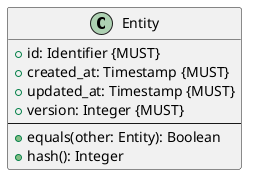
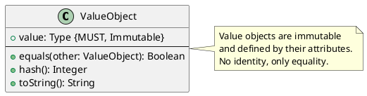
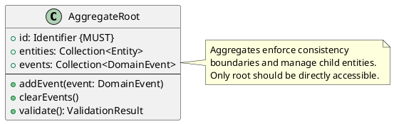
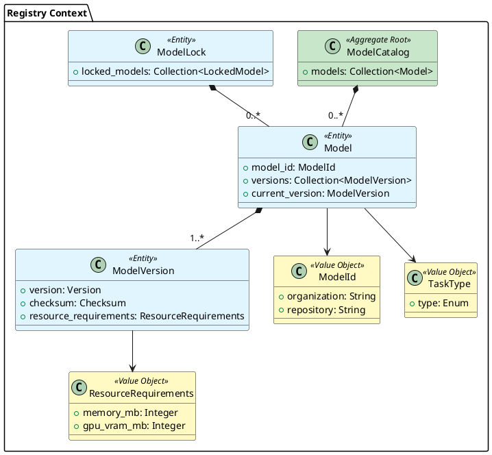
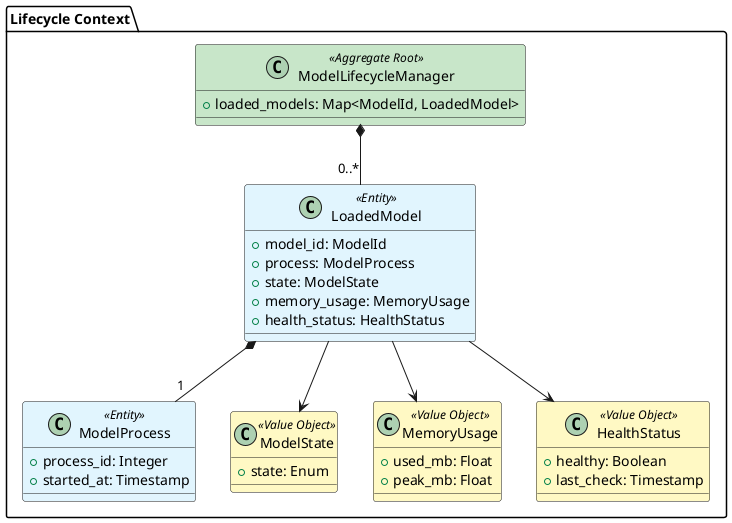
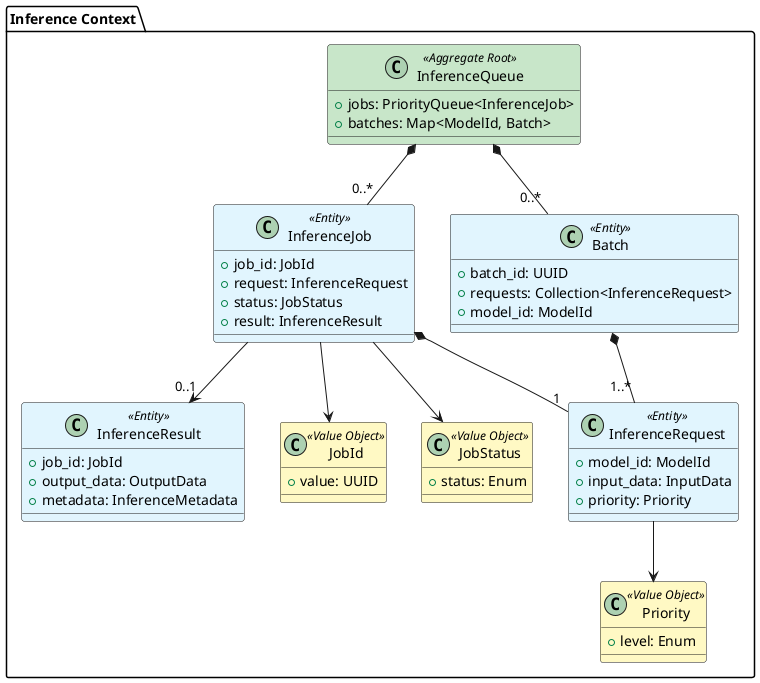

# ModelMora - Data Models Documentation

**Version:** 1.0.0
**Date:** 2025-12-04
**Status:** Draft

---

## 1. Introduction

### 1.1 Purpose

This document defines the data models used throughout ModelMora, providing language-agnostic specifications for entities, value objects, aggregates, and data transfer objects. Each model includes structural definitions, constraints, validation rules, and relationships.

### 1.2 Model Categories

ModelMora data models are organized into the following categories:

- **Domain Entities**: Core business objects with identity and lifecycle
- **Value Objects**: Immutable objects defined by their attributes
- **Aggregates**: Clusters of entities with a root and consistency boundary
- **Data Transfer Objects (DTOs)**: API request/response representations
- **Event Models**: Domain events for event-driven architecture
- **Persistence Models**: Database schema representations

### 1.3 Notation Conventions

- **MUST**: Required field, cannot be null/empty
- **SHOULD**: Recommended field, may be optional
- **MAY**: Optional field
- **Immutable**: Cannot be modified after creation
- **Derived**: Calculated from other fields

### 1.4 Validation Levels

- **Syntax**: Format and type validation
- **Semantic**: Business rule validation
- **Cross-Entity**: Referential integrity validation

---

## 2. Model Organization

Data models are organized by bounded context and detailed in separate files:

### 2.1 Registry Context Models

- [Model Entity](./data_models/registry/model_entity.md) - Core model representation
- [Model Version](./data_models/registry/model_version.md) - Version tracking
- [Model Lock](./data_models/registry/model_lock.md) - Reproducible deployment
- [Model Catalog Aggregate](./data_models/registry/model_catalog.md) - Collection management
- [Task Type](./data_models/registry/task_type.md) - Model capability enumeration
- [Resource Requirements](./data_models/registry/resource_requirements.md) - Compute specifications

### 2.2 Lifecycle Context Models

- [Loaded Model](./data_models/lifecycle/loaded_model.md) - In-memory model instance
- [Model Process](./data_models/lifecycle/model_process.md) - Worker process representation
- [Model Lifecycle Manager](./data_models/lifecycle/model_lifecycle_manager.md) - Lifecycle coordination
- [Model State](./data_models/lifecycle/model_state.md) - State enumeration
- [Memory Usage](./data_models/lifecycle/memory_usage.md) - Memory metrics
- [Health Status](./data_models/lifecycle/health_status.md) - Health check results

### 2.3 Inference Context Models

- [Inference Request](./data_models/inference/inference_request.md) - Request representation
- [Inference Job](./data_models/inference/inference_job.md) - Async job tracking
- [Batch](./data_models/inference/batch.md) - Request batching
- [Inference Queue Aggregate](./data_models/inference/inference_queue.md) - Queue management
- [Job Status](./data_models/inference/job_status.md) - Status enumeration
- [Priority](./data_models/inference/priority.md) - Priority levels
- [Input Data](./data_models/inference/input_data.md) - Task-specific input
- [Output Data](./data_models/inference/output_data.md) - Task-specific output

### 2.4 Observability Context Models

- [Metric](./data_models/observability/metric.md) - Time-series data point
- [Log Entry](./data_models/observability/log_entry.md) - Structured log message
- [Trace](./data_models/observability/trace.md) - Distributed tracing span

### 2.5 Cross-Cutting Models

- [API Request/Response DTOs](./data_models/dto/api_models.md) - REST API contracts
- [Event Models](./data_models/events/domain_events.md) - Domain event definitions
- [Error Models](./data_models/common/error_models.md) - Error representations

---

## 3. Common Patterns

### 3.1 Entity Pattern

All entities follow this pattern:



**Constraints**:

- `id` MUST be unique within entity type
- `created_at` MUST NOT be modified after creation
- `updated_at` MUST be updated on every modification
- `version` MUST increment on every modification (optimistic locking)

### 3.2 Value Object Pattern

All value objects follow this pattern:



**Constraints**:

- All fields MUST be immutable
- Equality based on structural comparison
- No identity field required

### 3.3 Aggregate Pattern

All aggregates follow this pattern:



**Constraints**:

- External references MUST only point to aggregate root
- Child entities MUST NOT be modified outside aggregate
- All changes MUST go through aggregate root methods
- Aggregate MUST maintain invariants

---

## 4. Data Type Definitions

### 4.1 Primitive Types

| Type | Description | Format | Example |
|------|-------------|--------|---------|
| String | UTF-8 text | - | `"hello"` |
| Integer | Whole number | - | `42` |
| Float | Decimal number | IEEE 754 | `3.14` |
| Boolean | True/false | - | `true` |
| Bytes | Binary data | Base64 (JSON) | `b"\x89PNG"` |

### 4.2 Semantic Types

| Type | Description | Format | Example |
|------|-------------|--------|---------|
| Timestamp | Point in time | ISO 8601 | `2025-12-04T10:30:00Z` |
| Duration | Time span | ISO 8601 | `PT30S` (30 seconds) |
| UUID | Unique identifier | RFC 4122 | `123e4567-e89b-12d3-a456-426614174000` |
| URL | Web resource | RFC 3986 | `https://example.com/model` |
| Email | Email address | RFC 5322 | `user@example.com` |
| Checksum | Hash digest | Hex string | `sha256:abc123...` |

### 4.3 Domain-Specific Types

| Type | Description | Pattern | Example |
|------|-------------|---------|---------|
| ModelId | HuggingFace identifier | `{org}/{repo}` | `sentence-transformers/all-MiniLM-L6-v2` |
| Version | Semantic version | `{major}.{minor}.{patch}` or branch | `v2.2.2`, `main` |
| TaskType | ML task category | Enumeration | `txt2embed` |
| Priority | Request priority | Enumeration | `high`, `medium`, `low` |
| ModelState | Lifecycle state | Enumeration | `loaded`, `unloaded` |

---

## 5. Relationship Diagrams

### 5.1 Registry Context Relationships



### 5.2 Lifecycle Context Relationships



### 5.3 Inference Context Relationships



---

## 6. Validation Rules

### 6.1 Global Validation Rules

These rules apply to all models across bounded contexts:

1. **Required Fields**: All fields marked `MUST` cannot be null, empty, or whitespace-only
2. **String Length**:
   - Short strings (names, ids): 1-255 characters
   - Medium strings (descriptions): 1-1000 characters
   - Long strings (text content): 1-100,000 characters
3. **Numeric Ranges**:
   - Positive integers: > 0
   - Non-negative integers: >= 0
   - Percentages: 0.0 - 100.0
   - Memory values: > 0 (in MB)
4. **Timestamps**:
   - MUST be in UTC
   - MUST follow ISO 8601 format
   - Future timestamps only allowed for scheduled operations
5. **Identifiers**:
   - MUST be unique within their scope
   - MUST NOT contain special characters (except hyphens and underscores)
   - MUST be case-sensitive

### 6.2 Business Rule Validation

#### Registry Context Rules

1. **Model Registration**:
   - ModelId MUST match pattern: `{org}/{repo}`
   - TaskType MUST be one of the supported types
   - Version MUST be semantic version or branch name
   - Checksum MUST be SHA256 format

2. **Model Versioning**:
   - Multiple versions allowed for same ModelId
   - Version strings MUST be unique per ModelId
   - Cannot delete version if it's marked as current

3. **Resource Requirements**:
   - memory_mb MUST be > 0
   - gpu_vram_mb MAY be 0 (CPU-only models)
   - cpu_threads MUST be > 0

#### Lifecycle Context Rules

1. **Model Loading**:
   - Cannot load model if memory threshold exceeded
   - Cannot load model if already in LOADING or LOADED state
   - MUST verify health after loading

2. **Model Eviction**:
   - Can only evict models in LOADED state
   - Cannot evict if processing active requests
   - MUST follow LRU policy

3. **State Transitions**:
   - Valid transitions: UNLOADED → LOADING → LOADED → UNHEALTHY
   - Valid transitions: LOADED → UNLOADED
   - Invalid: LOADING → UNLOADED (must complete or fail)

#### Inference Context Rules

1. **Request Submission**:
   - ModelId MUST exist in registry
   - InputData MUST match TaskType requirements
   - Priority MUST be valid enum value
   - Timeout MUST be > 0 and <= 600 seconds

2. **Batch Formation**:
   - All requests in batch MUST target same ModelId
   - Batch size MUST be > 0 and <= configured maximum
   - Requests MUST have compatible input shapes

3. **Job Management**:
   - JobId MUST be unique UUID
   - Cannot cancel job in COMPLETED or FAILED state
   - Cannot retrieve result if job not COMPLETED

---

## 7. Serialization Formats

### 7.1 JSON Representation

Default format for REST API and configuration files:

```json
{
  "model_id": "sentence-transformers/all-MiniLM-L6-v2",
  "version": "v2.2.2",
  "task_type": "txt2embed",
  "resource_requirements": {
    "memory_mb": 2048,
    "gpu_vram_mb": 0,
    "cpu_threads": 4
  },
  "created_at": "2025-12-04T10:30:00Z",
  "updated_at": "2025-12-04T10:30:00Z"
}
```

**Conventions**:

- Field names: snake_case
- Timestamps: ISO 8601 with UTC timezone
- Enums: lowercase strings
- Null values: excluded from JSON (omitempty)

### 7.2 Protocol Buffers Representation

Format for gRPC communication:

```protobuf
message Model {
  string model_id = 1;
  string version = 2;
  TaskType task_type = 3;
  ResourceRequirements resource_requirements = 4;
  google.protobuf.Timestamp created_at = 5;
  google.protobuf.Timestamp updated_at = 6;
}
```

**Conventions**:

- Field names: snake_case
- Field numbers: sequential, never reuse
- Optional fields: use wrapper types or `optional` keyword
- Enums: UPPERCASE with prefix

### 7.3 YAML Representation

Format for configuration and lock files:

```yaml
model_id: sentence-transformers/all-MiniLM-L6-v2
version: v2.2.2
task_type: txt2embed
resource_requirements:
  memory_mb: 2048
  gpu_vram_mb: 0
  cpu_threads: 4
created_at: 2025-12-04T10:30:00Z
updated_at: 2025-12-04T10:30:00Z
```

**Conventions**:

- Field names: snake_case
- Indentation: 2 spaces
- List items: dash prefix
- Comments: allowed with `#`

---

## 8. Database Schema Mapping

### 8.1 Persistence Strategy

- **Entities**: Map to database tables with primary key
- **Value Objects**: Embedded in parent table or separate table with foreign key
- **Aggregates**: Root table with cascade relationships to child tables
- **Events**: Event store table with JSON payload

### 8.2 Table Naming Conventions

- Singular entity name
- Lowercase with underscores: `model_version`
- Foreign key: `{entity}_id`
- Junction tables: `{entity1}_{entity2}`

### 8.3 Index Strategy

Primary indexes:

- Primary key (clustered): `id`
- Unique constraints: `model_id`, `version` combinations
- Foreign key indexes: All foreign key columns

Secondary indexes:

- Frequently queried fields: `task_type`, `status`, `created_at`
- Composite indexes: `(model_id, version)`, `(task_type, status)`

---

## 9. Model Evolution Strategy

### 9.1 Versioning Approach

- **Minor Changes**: Add optional fields, maintain backward compatibility
- **Major Changes**: Require version increment, migration path
- **Deprecation**: Mark fields as deprecated, maintain for 2 versions

### 9.2 Migration Guidelines

1. **Adding Fields**:
   - Always add as optional
   - Provide default values
   - Document in changelog

2. **Removing Fields**:
   - Deprecate first (1-2 versions)
   - Provide migration script
   - Update API documentation

3. **Changing Types**:
   - Create new field with new type
   - Migrate data
   - Deprecate old field
   - Remove in next major version

### 9.3 Backward Compatibility

- REST API: Support previous version URLs
- gRPC: Use field numbers, never reuse
- Database: Use migrations with up/down scripts
- Events: Version field in event payload

---

## 10. Cross-References

### 10.1 Related Documents

- [System Architecture](./architecture.md) - Component interactions
- [API Design](./api_design.md) - API contracts and schemas
- [Requirements](./requirements.md) - Functional requirements

### 10.2 Implementation Guidelines

- All models defined in `src/modelmora/{context}/domain/`
- DTOs defined in `src/modelmora/{context}/application/dto/`
- ORM models in `src/modelmora/{context}/infrastructure/sql/models/`
- Proto definitions in `protos/modelmora/v1/`

---

## 11. Model Documentation Index

Below is the complete index of all data model documentation files:

### Registry Context

- [Model Entity](./data_models/registry/model_entity.md)
- [Model Version](./data_models/registry/model_version.md)
- [Model Lock](./data_models/registry/model_lock.md)
- [Model Catalog Aggregate](./data_models/registry/model_catalog.md)
- [Task Type](./data_models/registry/task_type.md)
- [Resource Requirements](./data_models/registry/resource_requirements.md)

### Lifecycle Context

- [Loaded Model](./data_models/lifecycle/loaded_model.md)
- [Model Process](./data_models/lifecycle/model_process.md)
- [Model Lifecycle Manager](./data_models/lifecycle/model_lifecycle_manager.md)
- [Model State](./data_models/lifecycle/model_state.md)
- [Memory Usage](./data_models/lifecycle/memory_usage.md)
- [Health Status](./data_models/lifecycle/health_status.md)

### Inference Context

- [Inference Request](./data_models/inference/inference_request.md)
- [Inference Job](./data_models/inference/inference_job.md)
- [Batch](./data_models/inference/batch.md)
- [Inference Queue Aggregate](./data_models/inference/inference_queue.md)
- [Job Status](./data_models/inference/job_status.md)
- [Priority](./data_models/inference/priority.md)
- [Input Data](./data_models/inference/input_data.md)
- [Output Data](./data_models/inference/output_data.md)

### Observability Context

- [Metric](./data_models/observability/metric.md)
- [Log Entry](./data_models/observability/log_entry.md)
- [Trace](./data_models/observability/trace.md)

### Cross-Cutting

- [API DTOs](./data_models/dto/api_models.md)
- [Domain Events](./data_models/events/domain_events.md)
- [Error Models](./data_models/common/error_models.md)

---

## 12. Revision History

| Version | Date | Author | Changes |
|---------|------|--------|---------|
| 1.0.0 | 2025-12-04 | - | Initial data models documentation |
